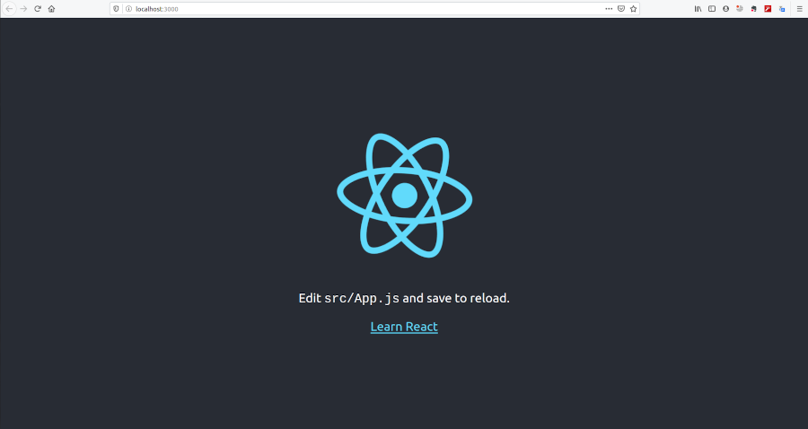
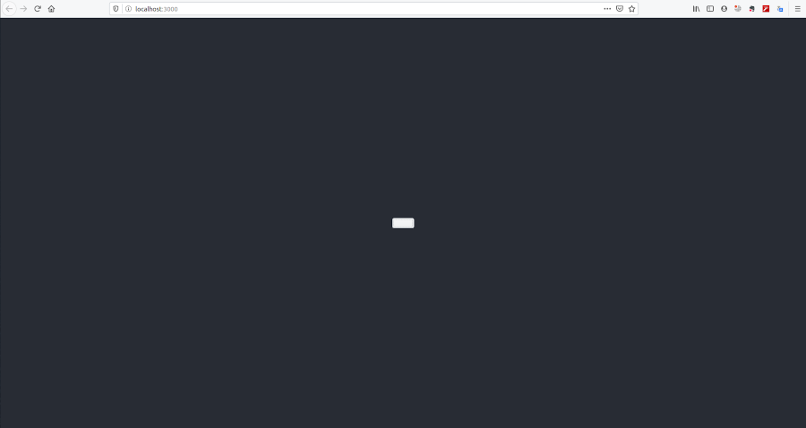
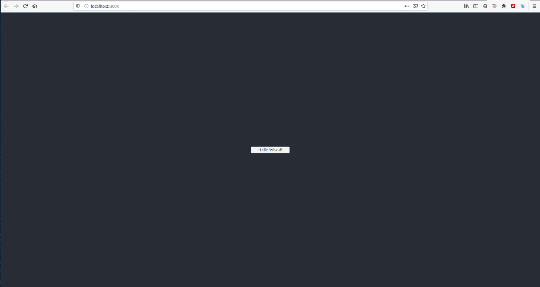
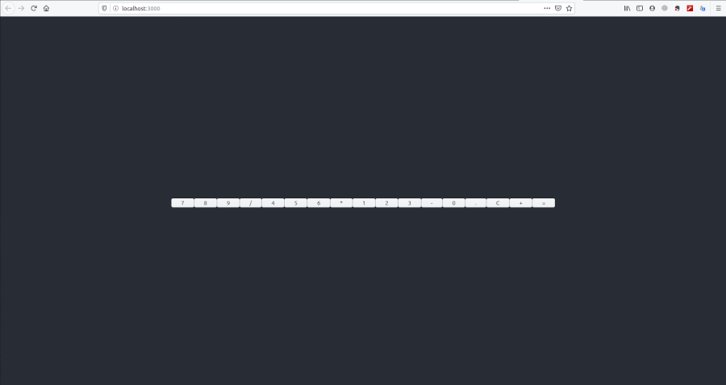
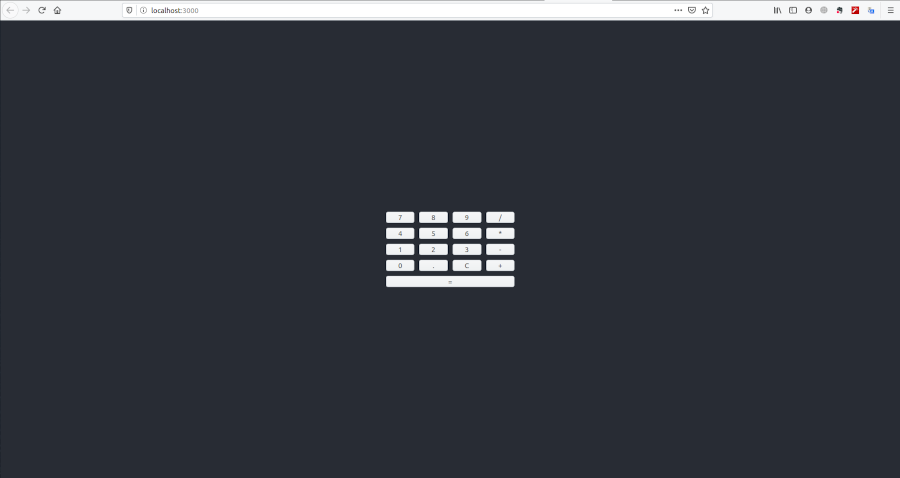
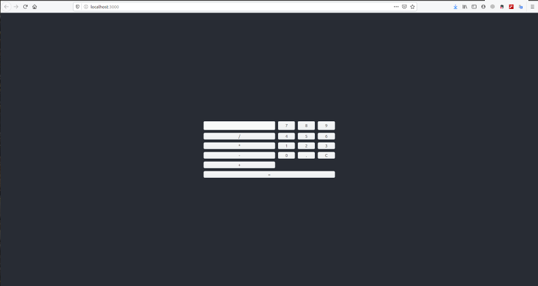
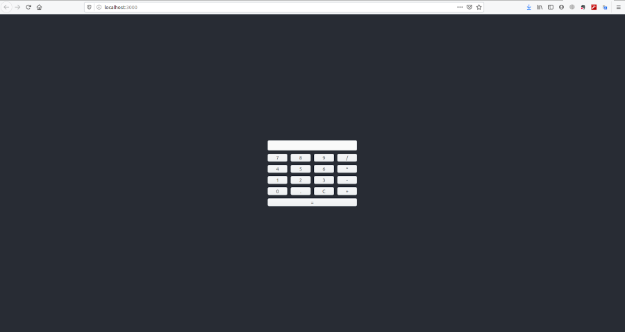

# Web API with C++

## Table of content

- [Web API with C++](#web-api-with-c)
  - [Table of content](#table-of-content)
  - [Introduction](#introduction)
  - [calculator Front-end](#calculator-front-end)
    - [What is `React`](#what-is-react)
    - [What is `Node.js`](#what-is-nodejs)
    - [What is `npm`](#what-is-npm)
    - [Install `Node.js` and `npm`](#install-nodejs-and-npm)
    - [Install `React`](#install-react)
    - [Create React App](#create-react-app)
  - [calculator Back-end](#calculator-back-end)
    - [What is `restbed`](#what-is-restbed)
    - [What is `JSON library for modern C++`](#what-is-json-library-for-modern-c)
    - [What is `cmake`](#what-is-cmake)
    - [Install `restbed`](#install-restbed)
    - [Install `JSON library for modern C++`](#install-json-library-for-modern-c)
    - [Install a C++ compiler](#install-a-c-compiler)
    - [Install `cmake`](#install-cmake)
    - [Create calculator web API application](#create-calculator-web-api-application)
    - [build calculator Back-end](#build-calculator-back-end)

## Introduction

In this course, I'm going to show you how `C++` can be used in modern web
development. I will implement a simple calculator web application which has
two parts:

* calculator_front-end
* calculator_back-end

In the first section I will use [`React`](https://reactjs.org/) to implement the
calculator web interface and in the second section I will use the
[`restbed`](https://github.com/Corvusoft/restbed) `C++` framework to implement
calculator API.  
Through this course you will be familiar with Single-page applications,
`JavaScript` frameworks and rest api.
Let’s start the front-end section.

## calculator Front-end

I'm going to use [`React`](https://reactjs.org/) to implement the calculator
user interface.

### What is `React`

`React` is a `JavaScript` library for building interactive web user interfaces.
In order to use `React` or any tools based in `JavaScript`, you’ll need to know
how to use npm and Node.js.

### What is `Node.js`

`JavaScript` is a client-side programming language, which means it's processed
in the browser. With `Node.js` `JavaScript` can also be used outside the
browser.

### What is `npm`

`npm` is a tool to download and install `Node.js` programs, plugins, modules and
so on.

### Install `Node.js` and `npm`

Read the following article to install and use`Node.js` and `npm`.  
[How to Install and Use Node.js and npm (Mac, Windows, Linux)](https://www.taniarascia.com/how-to-install-and-use-node-js-and-npm-mac-and-windows/)

### Install `React`

Now, to install `React`, run the following command in the terminal:  
`npm install -g create-react-app`  

If successful, you should be able to get version:  
`npm create-react-app --version`  

### Create React App

There are a few ways to use and set up `React`. Fortunately Facebook has created
`Create React App`, a tool that brings everything you need to build a `React`
app. It will create a live development server and use Webpack to automatically
compile React and JSX.  
Run the following command in the terminal to create a new react app.  

```sh
mkdir web_api_with_cpp
cd web_api_with_cpp
npx create-react-app calculator_front-end
```  

Once that finishes installing, move to the newly created directory and start the
project.  

```sh
cd calculator_front-end
npm start
```

Once you run this command, a new window will popup at `localhost:3000` with your
new `React` app.


If you look into the project structure, you'll see a `/public` and `/src`
directory, along with the regular `node_modules`, `.gitignore`, `README.md`, and
`package.json`.
The `/src` directory will contain all `JavaScript` codes.
In `/public`, our important file is `index.html`, which has a `root` div html
element.  
In `React` you can create `components`, which are like custom, reusable HTML
elements, to quickly and efficiently build user interfaces. React also has two
interesting concepts called `state` and `props` which is used to store and
handle data.  
I'm going to design the user interface from bottom to up, I'm going to start off
by designing a simple calculator button component.  
Now, make `src/CalculatorButton.js` file and implement `CalculatorButton`
React component:  

```JavaScript
import React from 'react';

function CalculatorButton(props) {

    return(
        <input type="button"/>
    );
}

export default CalculatorButton;
```

At the first line we've imported React, then we've implemented the
`CalculatorButton` React component, and finally we've exported it in order to be
visible outside.  
We can implement `React` components through classes or simple functions, if a
React component is implemented through functions, it must get an argument.
React passes `props` of components through this argument.  
In the body function a simple `input` `html` tag is returned. This is `JSX`
syntax, `JSX` stands for `JavaScript` and `XML`. Through the `JSX` feature we
can use and combine `JavaScript` and `XML` codes together.  
If you want to know how a `React` component can be used, you can modify
`index.js` file as following:  

```JavaScript
import React from 'react';
import logo from './logo.svg';
import './App.css';
import CalculatorButton from './CalculatorButton'

function App() {
  return (
    <div className="App">
      <header className="App-header">
        <CalculatorButton />
      </header>
    </div>
  );
}

export default App;
```

We've imported the `CalculatorButton` component then we've replaced the content
of the `header` tag with `<CalculatorButton />` tag. We can use `React`
components like `HTML` tags.  
Now you can see `CalculatorButton` component is rendered at the center of the
user interface:  


We need to display texts inside `CalculatorButton`, in fact the
`<CalculatorButton />` tag must get an attribute like `caption="Hello World!"`
and then display the value of the `caption` attribute inside itself.  
Now set the `caption` attribute of `<CalculatorButton />` to `"Hello World!"`:  

```JavaScript
<CalculatorButton caption="Hello World!" />
```

`React` passes these attributes to components as `props`. `CalculatorButton`
components must get `caption` from `props` and then display it.  
Now update `CalculatorButton`:  

```JavaScript
function CalculatorButton(props) {

    return(
        <input 
            type="button" 
            value={props.caption}/>
    );
}
```

We've got the `caption` attribute through `props` data structure and then set it
to the `value` attribute of `input` tag.  
Now you can see, the `caption` attribute of `CalculatorButton` is rendered:  


Now, It turns to designing all calculator buttons. Create
`src/CalculatorPanel.js` file, implement ‍‍new `CalculatorPanel` `React` component
as follows:  

```JavaScript
import React from 'react'
import CalculatorButton from './CalculatorButton'

function CalculatorPanel(props) {
  
  const captions = [
      "7", "8", "9", "/",
      "4", "5", "6", "*",
      "1", "2", "3", "-",
      "0", ".", "C", "+",
      "=",
    ];
  
  const calc_buttons = captions.map((value, index) => {
    return <CalculatorButton caption={value} />
  });

  return(
    <div>
      {calc_buttons}
    </div>
  );

}

export default CalculatorPanel;
```

We've declared `captions` array which contains all calculator buttons captions,
Then an array of `<CalculatorButton />`s is created through the `map` function,
and finally its returned inside a `<div>` `HTML` tag.  
Now, update `src/App.js` to render new `CalculatorPanel` component:  

```JavaScript
import CalculatorPanel from './CalculatorPanel'

function App() {
  return (
    <div className="App">
      <header className="App-header">
        <CalculatorPanel />
      </header>
    </div>
  );
}
```

Now you can see `CalculatorPanel` is rendered:  
  

We must arrange calculator buttons in a way that it looks similar a calculator,
Now declare new styles in `src/index.css` file:

```css
.calculator-grid-container {
  display: grid;
  grid-template-columns: auto auto auto auto;
  grid-template-rows: auto auto auto auto;
  grid-gap: 10px;
  padding: 10px;
}

.calculator-equal-button {
  grid-column: 1 / span 4;
}
```

We've declared `.calculator-grid-container` in order to arrange calculator
buttons in a 4x4 grid, and also `.calculator-equal-button` is declared to style
`=` button in a way which its width equal to the calculator width.  
Now update `CalculatorPanel` component to use these styles:  

```JavaScript
function CalculatorPanel(props) {
  
  const captions = [
      "7", "8", "9", "/",
      "4", "5", "6", "*",
      "1", "2", "3", "-",
      "0", ".", "C", "+",
      "=",
    ];
  
  const calc_buttons = captions.map((value, index) => {
    return <CalculatorButton caption={value} />
  });

  return(
    <div className="calculator-grid-container">
      {calc_buttons}
    </div>
  );

}
```

We've set `className` attribute of `div` html tag element to
`calculator-grid-container`, In React we must use `className` instead of `class`
attribute in `HTML` tags, because `class` is a reserved word in `JavaScript`.  
Now update the `CalculatorButton` component to use the `calculator-equal-button`
style:

```JavaScript
function CalculatorButton(props) {

    return(
        <input 
            type="button" 
            value={props.caption}
            className={props.caption === "=" ? "calculator-equal-button" : null}/>
    );
}
```

We've set the `className` attribute to the `calculator-equal-button`, if
`props.caption` equal to the `=`. This feature of React is called conditional
rendering, through this feature we can use conditions in conjunction with `HTML`
tags.  
Now you can see arranged calculator buttons in a grid is rendered:  
  

Our calculator needs a display. Let's create `src/CalculatorDisplay.js` file and
implement `CalculatorDisplay` component as follows:  

```JavaScript
import React from 'react'

function CalculatorDisplay(props) {
    return(
        <input 
            readOnly={true} 
            value={props.text} 
            />
    );
}

export default CalculatorDisplay;
```

We've implemented the `CalculatorDisplay` component by an `input` `HTML` tag.
The `readOnly` attribute has been set to `true` because the `CalculatorDisplay`
value must change only by `{props.text}` attribute, and the user must not be
able to change the value of `CalculatorDisplay`.  
Now we must add the `CalculatorDisplay` component at the top of
`CalculatorPanel`:  

```JavaScript
//...
import CalculatorDisplay from './CalculatorDisplay'

function CalculatorPanel(props) {
  
  //...

  return(
    <div className="calculator-grid-container">
      <CalculatorDisplay />
      {calc_buttons}
    </div>
  );

}
```

Now you can see the `CalculatorDisplay` component is rendered as follows:  
  

Calculator buttons are disordered. We must declare a new style for
`CalculatorDisplay` in order to place it at top of the calculator and also
it's width equal to the calculator width.  
Now add the following code at the end of the `index.css`:  

```css
.calculator-display {
  grid-column: 1 / span 4;
}
```

We've declared `.calculator-display` to style `CalculatorDisplay`, Now update
`CalculatorDisplay` component as follows:  

```JavaScript
function CalculatorDisplay(props) {
    return(
        <input 
            readOnly={true} 
            value={props.text}
            className="calculator-display" 
            />
    );
}
```

We've set the `className` attribute of `input` `HTML` tag to the
`calculator-display` and you can see its result as follows:  
  

If you click on each button, nothing happens. We must implement the behavior of
calculator buttons. We're going to implement these behaviors in a new `React`
component.  
Now create `src/Calculator.js` file:  

```JavaScript
import React from 'react'
import CalculatorPanel from './CalculatorPanel'

class Calculator extends React.Component {

  operationHandler(operation){
  }

  numberHandler(number) {
  }

  dotHandler() {
  }

  clearHandler() {
  }

  equalHandler() {
  }

  render() {
    return (
        <div className="calculator-grid-container">
          <CalculatorPanel 
            numberClicked={this.numberHandler.bind(this)}
            operationClicked={this.operationHandler.bind(this)}
            dotClicked={this.dotHandler.bind(this)}
            equalClicked={this.equalHandler.bind(this)}
            clearClicked={this.clearHandler.bind(this)}
            />
        </div>
      );
  }
}

export default Calculator;
```

We've implemented calculator buttons handlers in the `Calculator` component.
In the `render` function, we've added a `CalculatorPanel` component and passed
handler functions through the `CalculatorPanel` attributes.  
I should mention that `React` components didn't bind `this` object to its
functions. As you can see, we must bind `this` object to function handlers
explicitly.  
`CalculatorPanel` component must get function handlers of buttons and calls
these handlers when buttons are clicked.  
Now update `CalculatorPanel` component as follows:  

```JavaScript
function CalculatorPanel(props) {
  
  const buttons = [
    {text: "7", handler: () => props.numberClicked("7")}, 
    {text: "8", handler: () => props.numberClicked("8")}, 
    {text: "9", handler: () => props.numberClicked("9")}, 
    {text: "/", handler: () => props.operationClicked("divide")}, 
    {text: "4", handler: () => props.numberClicked("4")}, 
    {text: "5", handler: () => props.numberClicked("5")},
    {text: "6", handler: () => props.numberClicked("6")},
    {text: "*", handler: () => props.operationClicked("multiply")}, 
    {text: "1", handler: () => props.numberClicked("1")},
    {text: "2", handler: () => props.numberClicked("2")},
    {text: "3", handler: () => props.numberClicked("3")},
    {text: "-", handler: () => props.operationClicked("subtract")},
    {text: "0", handler: () => props.numberClicked("0")},
    {text: ".", handler: () => props.dotClicked()},
    {text: "C", handler: () => props.clearClicked()},
    {text: "+", handler: () => props.operationClicked("add")},
    {text: "=", handler: () => props.equalClicked()},
  ];
  
  const calc_buttons = buttons.map((value, index) => {
    return <CalculatorButton 
      caption={value.text} 
      onClick={value.handler} />
  });

  return(
    <div className="calculator-grid-container">
    <CalculatorDisplay />
      {calc_buttons}
    </div>
  );

}
```

We've changed captions array to buttons array, and every item of this array
specified `text` and `handler` of buttons. Each handler is an arrow function
which calls the buttons handler with proper arguments. Buttons handlers are
passed through `props` data structure.  
We've updated the `map` function, and the handler of the button is passed to the
`CalculatorButton` component through the `onClick` attribute. `CalculatorButton`
component must get the handler and call it when the button is clicked.  
Now update the `CalculatorButton` component as follows:  

```JavaScript
function CalculatorButton(props) {

    return(
        <input 
            type="button" 
            value={props.caption}
            className={props.caption === "=" ? "calculator-equal-button" : null}
            onClick={props.onClick}
            />
    );
}
```

We've bound the `props.onClick` handler to the `onClick` event of `input` `HTML`
tag, and it causes every time the button is clicked, `props.onClick` is called.  
`Calculator` component must display proper values in the `CalculatorDisplay`
component when it's handlers are called.
At first `CalculatorDisplay` must be able to get its text from outside.  
Now update `CalculatorDisplay` component as follows:  

```JavaScript
function CalculatorDisplay(props) {
    return(
        <input 
            className="calculator-display" 
            readOnly={true} 
            value={props.text} 
            />
    );
}
```

We've bound the `value` attribute of `input` `HTML` tag to the `props.text`. We
can display new values through setting the `text` attribute of
`CalculatorDisplay` from outside.  
`Calculator` component must set and update the text of `CalculatorDisplay` every
time which one of the calculator buttons is clicked.  
Now update `Calculator` component as follows:  

```JavaScript
class Calculator extends React.Component {

  constructor(props) {
    super(props);
    this.state = {
      result: "",
    };
  }

  render() {
    return (
        <div className="calculator-grid-container">
          <CalculatorPanel 
            result={this.state.result} 
            numberClicked={this.numberHandler.bind(this)}
            operationClicked={this.operationHandler.bind(this)}
            dotClicked={this.dotHandler.bind(this)}
            equalClicked={this.equalHandler.bind(this)}
            clearClicked={this.clearHandler.bind(this)}
            />
        </div>
      );
  }
}
```

We've implemented the `constructor` function of the `Calculator` component in
order to initialize the `state` object. `state` is a special object in `React`
components.  
`state` is similar to `props`, but it is private and fully controlled by the
component. `state` objects can contain several independent variables.  
In the `render` function we have set the `result` attribute of `CalculatorPanel`
component to the `result` variable of `state` object.  
Every time the state is updated, `React` renders the `CalculatorPanel` component
in order to display new results.  
Now update `CalculatorPanel` component in way that it gets the `result`
attribute and updates the `CalculatorDisplay` component:  

```JavaScript
function CalculatorPanel(props) {
  
  //...
  
  return(
    <div className="calculator-grid-container">
    <CalculatorDisplay text={props.result} />
      {calc_buttons}
    </div>
  );

}
```

We've set the `text` attribute of the `CalculatorDisplay` component to the
`props.result`, and it causes the `CalculatorDisplay` component to be updated
when `props.result` is changed.  
We're going complete the implementation of function handlers in `Calculator`
component, We're going to start by `numberHandler`:  

```JavaScript
class Calculator extends React.Component {

  constructor(props) {
    super(props);
    this.state = {
      result: "",
      numbers: ["", ""],
      numberIdx: 0,
    };
  }

  numberHandler(number) {
    const newNumber = this.state.numbers[this.state.numberIdx] + number;
    this.updateNumber(newNumber);
  }

  updateNumber(newNumber) {
    var newNumbers = this.state.numbers;
    newNumbers[this.state.numberIdx] = newNumber;
    this.setState({
      result: newNumbers[this.state.numberIdx],
      numbers: newNumbers,
    });
  }

}
```

We've added new variables to `state` object, `numbers` array which has two empty
strings, `numberIdx` variable which is set to `0`. All operations of this
calculator are binary operations, which means operations need two numbers. We're
going to store these two numbers in `numbers` array. `numberIdx` specifies which
number the user has entered, first number or second number.  
`numberHandler` is called when the user clicks on each number button, and
number is passed to the handler through the `number` argument. In this function
we've updated the `numbers` array in `state` object.  
Beer in mind, we must update `state` objects only through the `setState`
function.  
Now we're going to complete the implementation of `dotHandler` function:  

```JavaScript
dotHandler() {
    const newNumber = this.state.numbers[this.state.numberIdx] + ".";
    if(isNaN(newNumber)) {
      return
    } 
    this.updateNumber(newNumber);
}
```

This function adds `.` to the numbers in order to cast them to the float
numbers. And finally updates the `numbers` array in `state` object through
`updateNumber` function which is implemented in the previous step.  
Now it turns to `operationHandler`:  

```JavaScript

class Calculator extends React.Component {

  constructor(props) {
    super(props);
    this.state = {
      result: "",
      numbers: ["", ""],
      numberIdx: 0,
      operation: "",
    };
  }

  operationHandler(operation){
    if(this.state.numberIdx === 1) {
      this.equalHandler();
      return;
    }

    if( (operation === "subtract" || operation === "add") &&
          this.state.numbers[this.state.numberIdx] === "") {
      this.numberHandler(operation === "subtract" ? "-" : "+");
      return;
    }

    this.setOperation(operation);
  }

  setOperation(operation){
    this.setState({operation: operation});
    this.nextNumber();
  }

  nextNumber() {
    const newIdx = this.state.numberIdx === 0 ? 1 : 0;
    this.setState({
      result: this.state.numbers[newIdx],
      numberIdx: newIdx,
    });
  }

}
```

We've added a new `operation` variable to the `state` object in order to store
operations the which user clicked.  
`operationHandler` is called when of of these operations `+`, `-`, `*` and `/`
is clicked. We've updated the `numberIdx` and  `operation` variable.  
Also when users click on `+` or `-` buttons which didn't enter any numbers
before, then we add a `+` or `-` in front of the number. And if a user
enters two numbers and then clicks on one of the operation buttons then we call
the `equalHandler` function, which it equals to click on `=` button.  
Now implement `equalHandler`:  

```JavaScript
setResult(result){
  const newNumbers = [result, ""];
  const newNumberIdx = 0;
  this.setState({
    result: newNumbers[newNumberIdx],
    numbers: newNumbers,
    numberIdx: newNumberIdx,
    operation: "",
  });
}

equalHandler() {
  if(this.state.numbers[0] === "" || this.state.numbers[1] === "") {
    return
  }
  this.props.calculatorApi.calculate(
    this.state.numbers[0], 
    this.state.numbers[1], 
    this.state.operation, 
    (result)=> {
      this.setResult(result);
    });
}
```

We've supposed that an object is passed through `props` object called
`calculatorApi`. Through this object we can call the calculator API. This object
has a function called `calculate` which gets the first number, second number,
operation and a handler as arguments.  
We've called this function in order to send numbers and operation to the
Back-end API, when the result is gotten ready, the handler is called and the
result is passed through the handler argument.  
Finally we're going to implement `clearHandler`:  

```JavaScript
clearHandler() {
  this.setState({
    result: "",
    numbers: ["", ""],
    numberIdx: 0,
  });
}
```

`clearHandler` sets the `state` object to initial state.  
Now we must implement the `CalculatorApi` component. create
`src/CalculatorApi.js` class as follows:  

```JavaScript
class CalculatorApi {

    calculate(number1, number2, operation, handler) {

    }

}

export default CalculatorApi;
```

`CalculatorApi` is a simple `JavaScript` class, it's not a `React` component.
As we need, `CalculatorApi` has a `calculate` function which gets two numbers,
an operation and a handler.  
Now implement `calculate` function as follows:  

```JavaScript
class CalculatorApi {

    constructor(serviceAddress) {
        this.serviceAddress = serviceAddress;
    }

    makeURL(number1, number2, operation) {
        const resource = operation + "/" + number1 + "/" + number2;
        return new URL(resource, this.serviceAddress);
    }

    calculate(number1, number2, operation, handler) {
        fetch(this.makeURL(number1, number2, operation))
        .then(res => res.json())
        .then((response)=> {
            handler(response["result"]);
          },
          (err)=> {
            handler(err);
            console.log(err);
          }
        );
    }
}
```

`calculate` function uses the `fetch` API in order to communicate
with the calculator API. `CalculatorApi` also gets calculator API address
thorough its `constructor` function.  
We must create an object from `CalculatorApi` and pass it to the
`Calculator` class. Now update `App.js`:  

```JavaScript
import Calculator from './Calculator'
import CalculatorApi from './CalculatorApi'

function App() {
  return (
    <div className="App">
      <header className="App-header">
        <Calculator calculatorApi={new CalculatorApi('http://127.0.0.1:8080')} />
      </header>
    </div>
  );
}
```  

We've changed the `CalculatorPanel` component to `Calculator` component. And
also we've created an object from the `CalculatorApi` component and passed it to
the `Calculator` component through the `calculatorApi` attribute.  
Congratulations.!  
You've completed the calculator front-end section. Now Let's dive into the
calculator back-end section.  

## calculator Back-end

We're going to use `restbed` C++ framework to implement calculator web API.  

### What is `restbed`

`restbed` is a C++11 framework which enables us to implement RESTful web APIs.  
We're going to implement calculator web API in the form of a JSON web API. So we
need a C++ JSON Library. There are a lot of JSON libraries, We’ve selected
`JSON library for modern C++`.

### What is `JSON library for modern C++`

It's a single header JSON library for C++ programming language. It's a single
header JSON library for C++ programming language. You’ll see It has an intuitive
syntax.  
Also we need a cross platform build system which enables us to build calculator
web API. We’re going to use cmake as a build system.  

### What is `cmake`

`cmake` is a cross-platform, open-source build system. `cmake` is used to build
test and package `C++` software on many platforms like `Windows`, `Linux` and
`mac`.  

### Install `restbed`

If you have a `Linux` machine, you can run the following command in the terminal
to install `restbed`:  

```sh
sudo apt-get update
sudo apt install librestbed-dev
```

Otherwise you can build and install it through `cmake`, read `restbed`
[documentation for details](https://github.com/Corvusoft/restbed).  

### Install `JSON library for modern C++`

`JSON library for modern C++` is a single header library. Download it's header
file through [this link](https://github.com/nlohmann/json).

### Install a C++ compiler

`C++` codes need to compile. So we need a `C++` compiler.  
If you have a linux machine, you might have `GCC`.  Also you can install
`Visual C++` for `Windows` or `clang` for `mac os`.

### Install `cmake`

If you have a `Linux` machine, you can run the following command in the terminal
to install `cmake`:  

`sudo apt-get install cmake`

Otherwise you can install it through [this link](https://cmake.org/download/).  

### Create calculator web API application

Create new directory in the `web_api_with_cpp` directory called
`calculator_back-end`:  

```sh
cd ..
mkdir calculator_back-end
```

The fundamental concept in any RESTful API is the resource. A resource is an
object with a type, associated data, relationships to other resources, and a set
of methods that operate on it. It is similar to an object instance in an
object-oriented programming language, with the important difference that only a
few standard methods are defined for the resource (corresponding to the standard
HTTP GET, POST, PUT and DELETE methods), while an object instance typically has
many methods. We can consider the calculator API as a resource.  
`restbed` framework has a class called `Resource`. `Resource` class helps us to
implement resources in our RESTful API. For each resource we must declare an
object from the `Resource` class, and then implement methods of resource which
we need, and then bind these methods to the resource object. We're going to do
this stuff through a class. First, let's implement an interface for this class.  
Create `calculator_back-end/include` directory:  

```sh
cd calculator_back-end
mkdir include
```

Now create new `C++` header file in `include` directory called
`IResourceFactory.h`:  

```C++
#pragma once

#include <memory>
#include <restbed>

using namespace std;
using namespace restbed;

class IResourceFactory {

public:

    virtual shared_ptr<Resource> get_resource() const = 0;

};
```

We've created an `include` directory in order to place all `C++` header files
inside it. Then we've implemented a class called `IResourceFactory`. The `I`
letter in front of its name stands for interface, which means `IResourceFactory`
is an interface class and all it's functions are abstract functions. Every
resource factory class must implement this interface.
This interface has an abstract function called `get_resource`. Every resource
factory concrete class must prepare resource and finally deliver to the its
customer through `get_resource` function, in more details means concrete classes
must create an object from `Resource` class and then implement all functions
which it needs then bind functions to the `Resource` object and finally return
`Resource` object in the `get_resource` function.  
Now Let's create a `CalcResourceFactory` class. Create
`include/CalcResourceFactory.h` file:  

```C++
#pragma once

#include "IResourceFactory.h"

class CalcResourceFactory : public IResourceFactory {

public:

  CalcResourceFactory();
  shared_ptr<Resource> get_resource() const final;

private:

  shared_ptr<Resource> _resource;

};
```

We've declared new a class which implements `IResourceFactory` interface called
`CalcResourceFactory`, this class has a constructor function and also a member
object called `_resource`. Its member object is a `shared_pointer` from
`Resource` class. We've said every resource factory must prepare an object from
the `Resource` class and then deliver it through the `get_resource` function.  
Now, Let's implement it's constructor. Create new `CalcResourceFactory.cpp`
source file (Note: create source files inside calculator_back-end directory) as
follows:  

```C++
#include "CalcResourceFactory.h"

CalcResourceFactory::CalcResourceFactory() {
  _resource = make_shared<Resource>();
  _resource->set_path(
      "/{operation: add|subtract|multiply|divide}"
      "/{num1: [-+]?[0-9]*\\.?[0-9]*}"
      "/{num2: [-+]?[0-9]*\\.?[0-9]*}");
}
```

We've initialized `_resource` object to a newly allocated `shared_pointer`
from `Resource` class. Every resource in RESTful APIs must associate with an
url. We've associated an url to `_resource` object through `set_path` function.  
This url has three parts, we've labeled each part with following labels:

- `operation`
- `num1`
- `num2`

You'll see we can read each part of the path through these labels.  
We can reach to the resource through an url like this:  
`/add/2/3`  

We've used regular expression syntax in order to filter each part of the url.
`operation` part must accept only `add` or `subtract` or `multiply` or `divide`
parameters which specify the calculator functionality. `num1` and `num2` parts
must accept only float or integral numbers which specify calculator
functionality operands.  
Every `Resource` object must have a handler which is called when resource is
requested by a client.  
We can set method handler of `Resource` object through `set_method_handler` function:  

`CalcResourceFactory.h`:

```C++
class CalcResourceFactory : public IResourceFactory {

  // ...

private:

  void get_handler(const shared_ptr<Session> session);

  //...
};
```

`CalcResourceFactory.cpp`:

```C++
CalcResourceFactory::CalcResourceFactory() {
  //...

  _resource->set_method_handler("GET",
        [&](const auto session) {
            get_handler(session);
        });
}

void CalcResourceFactory::get_handler(const shared_ptr<Session> session) {
}
```

We've set `get_handler` function to `_resource` object as a method handler.
`set_method_handler` gets two arguments, first argument specifies `http` method
and second argument specifies function handler. Every time `_resource` is
requested `get_handler` is called and an object is passed to the handler called
`session`. Through the `session` object we can get any information about
requests and send results to the client.  
Now, Let's implement `get_handler` function:  

`CalcResourceFactory.h`:

```C++
//...

#include <string>
#include <tuple>

class CalcResourceFactory : public IResourceFactory {

  //...

private:

  tuple<float, float, string>
    get_path_parameters(const shared_ptr<Session> session) const;

  //...
};
```

`CalcResourceFactory.cpp`:

```C++
tuple<float, float, string> CalcResourceFactory::get_path_parameters(
        const shared_ptr<Session> session) const {
    const auto& request = session->get_request();
    const auto operation = request->get_path_parameter("operation");
    auto num1 = atof(request->get_path_parameter("num1").c_str());
    auto num2 = atof(request->get_path_parameter("num2").c_str());
    return make_tuple(num1, num2, operation);
}

void CalcResourceFactory::get_handler(const shared_ptr<Session> session) {
  const auto [num1, num2, operation] = get_path_parameters(session);
}
```

We've implemented a new function called `get_path_parameters` to get the values
of labels in the url which is requested.
In the `get_path_parameters` we've got the `request` object from the `session`
object through the `get_request` function. Then we've got the `operation`,
`num1` and `num2` values of the url through the `get_path_parameter` function.
Then we've converted the `num1` and `num2` values to float numbers. Finally
we've returned the values through a tuple object.  
In the `get_handler` function we've called the `get_path_parameters` function
and passed the `session` object as an argument. Then we've set the `num1`,
`num2`, `operation` variable to the values of the `tuple` object which is
returned. Did you see this feature before??
It's amazing. This feature is called `structured binding` which was added in
C++17 standard.  
Now we must prepare the result of calculation:  

`CalcResourceFactory.h`:

```C++
//...
class CalcResourceFactory : public IResourceFactory {
  //...
private:

  float calculate(float num1, float num2, string operation);
  //...
};
```

`CalcResourceFactory.cpp`:

```C++
float CalcResourceFactory::calculate(float num1, float num2, string operation) {
  if(operation == "add") {
      return num1 + num2;
  }
  else if(operation == "subtract") {
      return num1 - num2;
  }
  else if(operation == "multiply") {
      return num1 * num2;
  }
  else if(operation == "divide") {
      return num1 / num2;
  }
}

void CalcResourceFactory::get_handler(const shared_ptr<Session> session) {
    const auto [num1, num2, operation] = get_path_parameters(session);
    auto result = calculate(num1, num2, operation);
}
```

We've implemented a new function called `calculate` to calculate the result. The
`calculate` function gets `num1`, `num2` and `operation` as arguments.  
In the `get_handler` function, we've called the `calculate` function and set the
`result` variable to returned value.  
Now we must create a `JSON` data structure and put the result inside it in order
to send to the user.  
First copy the `json.hpp` library into `include` directory which you've
downloaded in the previous steps.
Then use `json` library to create `json` data structure:  

`CalcResourceFactory.h`:

```C++
//...
class CalcResourceFactory : public IResourceFactory {
  //...
private:

  string to_json(float result);
  //...
};
```

`CalcResourceFactory.cpp`:

```C++
#include <sstream>
#include <iomanip>
#include "json.hpp"

using namespace nlohmann;

string CalcResourceFactory::to_json(float result) {
  ostringstream str_stream;
  str_stream << result;
  json jsonResult = {
      {"result", str_stream.str()}
  };
  return jsonResult.dump();
}

void CalcResourceFactory::get_handler(const shared_ptr<Session> session) {
  const auto [num1, num2, operation] = get_path_parameters(session);
  auto result = calculate(num1, num2, operation);
  auto content = to_json(result);
}
```

At first we've included `sstream`, `iomanip` and `json.hpp` header files.
We've implemented a new function called `to_json` to get the result of
calculation and put it inside a `JSON` data structure. In the `to_json` function
first we've formatted `result` variable through an `stringstream` object, then
we've declared a new `jsonResult` variable from `json` class, and then we've
initialized it with `JSON` data structure in an intuitive manner. This `JSON`
data structure has a variable called `result` which is set to formatted `result`
variable. Finally we've converted the `JSON` data structure to a `string` object
and returned it.  
In the `get_handler` function we've called the `to_json` function and passed the
result of calculation as argument, then set the `content` variable to returned
value.  
Finally we must send data to the client:  

`CalcResourceFactory.cpp`:

```C++
void CalcResourceFactory::get_handler(const shared_ptr<Session> session) {
    const auto [num1, num2, operation] = get_path_parameters(session);
    auto result = calculate(num1, num2, operation);
    auto content = to_json(result);
    session->close(OK, content,
        {{"Content-Length", to_string(content.size())}});
}
```

We've sent data through calling the `close` function of `session` object.
`close` function gets three arguments, `http` status code, message body and
`http` headers. We've passed `OK` as `http` status code, `result` JSON data as
message body and a `std::mulitmap` object as `http` headers which contains a
field called `Content-Length` specifying length of message body.  
Now it turns to implement `get_resource` function:  

`CalcResourceFactory.cpp`:

```C++
shared_ptr<Resource> CalcResourceFactory::get_resource() const {
  return _resource;
}
```

The `get_resource` function just returns `_resource` object.  
Now we must publish calculator resource through a web service. The `restbed`
framework has a class called `Settings` to initialize settings of a web service.  
Now we're going to implement a new class in order to create settings of
calculator web service. We start off by designing its interface, Create new
`include/IServiceSettingsFactory.h` and implement this interface as follows:  

```C++
#pragma once

#include <memory>
#include <restbed>

using namespace std;
using namespace restbed;

class IServiceSettingsFactory {

public:

  virtual shared_ptr<Settings> get_settings() const = 0;

};
```

This interface is similar to the `IResourceFactory` interface. We can abstract
these interfaces more, but it's beyond this course.  
The `IServiceSettingsFactory` interface has an abstract function called
`get_settings`, every concrete class which implements this interface must
prepare and create web service settings and then deliver settings through the
`get_settings` function.  
Now it turns to creating a calculator web service settings factory class. Create
new `include/CalcServiceSettingsFactory.h` header file as follows:  

```C++
#pragma once

#include "IServiceSettingsFactory.h"

class CalcServiceSettingsFactory : public IServiceSettingsFactory {

public:

    CalcServiceSettingsFactory();
    shared_ptr<Settings> get_settings() const final;

private:

    std::shared_ptr<Settings> _settings;

};
```

We've declared a new class called `CalcServiceSettingsFactory` which implements
`IServiceSettingsFactory` interface. Also we've declared a constructor function
and a member object called `_settings`. The member object is a `shared_ptr` from
`Settings` class.  
Let's create `CalcServiceSettingsFactory.cpp` source file and implement
constructor function as follows:  

```C++
#include "CalcServiceSettingsFactory.h"

CalcServiceSettingsFactory::CalcServiceSettingsFactory() {
    _settings = make_shared<Settings>();
    _settings->set_port(8080);
    _settings->set_default_header("Connection", "close");
    _settings->set_default_header( "Access-Control-Allow-Origin", "*");
}
```

We've created an object from `Settings` class. This object is used to specify
web service settings. We've set port number and two default `http` headers
through this object. `Access-Control-Allow-Origin` headers is set to `*` in
order to prevent `CORS` errors, for further information about this error you can
read
[this article](https://developer.mozilla.org/en-US/docs/Web/HTTP/CORS/Errors).  
Now implement `get_settings` function as follows:  

```C++
shared_ptr<Settings> CalcServiceSettingsFactory::get_settings() const {
    return _settings;
}
```

The `get_settings` function only returns the `_settings` object.  
Now we must create the calculator web service. The `restbed` framework has a
class called `Service` which helps us to create web services and publish
resources. We're going to implement a new class to implement calculator web
service through `Service` class.  
Let's start by designing the interface. Create new `include/IService.h` header
file and implement `IService` interface as follows:  

```C++
#pragma once

class IService {

public:

  virtual void start() = 0;

};
```

We've declared an `IService` interface. Inside the `IService` interface we've
declared an abstract function called `start`. Every concrete service class which
implements this interface must get resources and settings objects and then
initialize a web service, and when the `start` function is called, it must
ignite the web service.  
Let's implement the concrete calculator service class. Create a new
`include\CalcService.h` header file and implement `CalcService` class as
follows:

```C++
#pragma once

#include "IService.h"

#include "IResourceFactory.h"
#include "IServiceSettingsFactory.h"

class CalcService : public IService {

public:

    CalcService(
        shared_ptr<IResourceFactory> resource_factory,
        shared_ptr<IServiceSettingsFactory> settings_factory);
    void start() final;

private:

    Service _service;
    shared_ptr<IServiceSettingsFactory> _settings_factory;

};
```

‍‍The `CalcService` class‍‍‍‍ implements the `IService` interface. It has two member
objects, an object from the `Service` class called `_service` and a `shared_ptr`
object from `IServiceSettingsFactory` interface called `_settings_factory`. Also
it has a constructor function which gets two interfaces, `IResourceFactory` and
`IServiceSettingsFactory` interfaces.  
Now Let's start by implementing the constructor function. Create
a `CalcService.cpp` resource file and implement the constructor function as
follows:  

```C++
#include "CalcService.h"

CalcService::CalcService(
        shared_ptr<IResourceFactory> resource_factory,
        shared_ptr<IServiceSettingsFactory> setting_factory) {
    _settings_factory = settings_factory;
    _service.publish(resource_factory->get_resource());
}
```

We've initialized the `_settings_factory` member object with `settings_factory`
argument. Then We've got the calculator resource object from the
`resource_factory` object, and finally we've published the calculator resource
through calling the `publish` function of the `_service` object.  
Now it turns to implementing the `start` function:  

```C++
void CalcService::start() {
    _service.start(_settings_factory->get_settings());
}
```

We've called the `get_settings` function of `_settings_factory` to get the
`Settings` object, finally we've passed the returned object to the start
function.  Through calling the `start` function calculator web service will be
started.  
Now it's time to connect classes together. Create a new `main.cpp` file and
implement the `main` function as follows:

```C++
#include "CalcResourceFactory.h"
#include "CalcServiceSettingsFactory.h"
#include "CalcService.h"

int main(const int, const char**)
{
  auto resource_factory = make_shared<CalcResourceFactory>();
  auto settings_factory = make_shared<CalcServiceSettingsFactory>();
  CalcService service {resource_factory, settings_factory};
  service.start();
  
  return EXIT_SUCCESS;
}
```

It's very simple. As you see if software is developed in a modular manner,
everything becomes simple, beautiful and self expressive.  
Congratulations. You did it!  
Let's compile and build the calculator web API project.  

### build calculator Back-end

We're going to build calculator back-end through `cmake`. Create
`calculator_back-end/CMakeLists.txt` file and copy following code into it:  

```CMAKE
cmake_minimum_required(VERSION 3.0)

project(CalculatorAPI)

add_executable(CalculatorAPI
    main.cpp
    CalcResourceFactory.cpp
    CalcService.cpp
    CalcServiceSettingsFactory.cpp)
target_link_libraries(CalculatorAPI restbed)
target_include_directories(CalculatorAPI PUBLIC ${CMAKE_SOURCE_DIR}/include)
set_property(TARGET CalculatorAPI PROPERTY CXX_STANDARD 17)
```

Now you can build project through running the following command in the terminal:  

```sh
cmake -Hcalculator_back-end -Bcalculator_back-end/build
cmake --build calculator_back-end/build --config Release --target all
```

Now you can run calculator API through running following command in the
terminal:  

`calculator_back-end/build/CalculatorAPI`

Congratulations!  
The `calculator_back-end` is completed, Now you can work with calculator.
